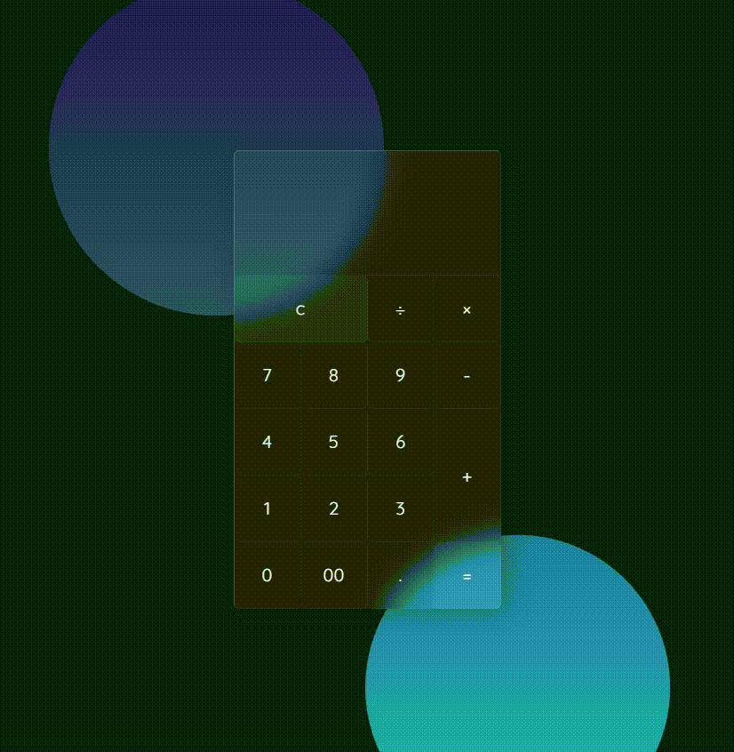
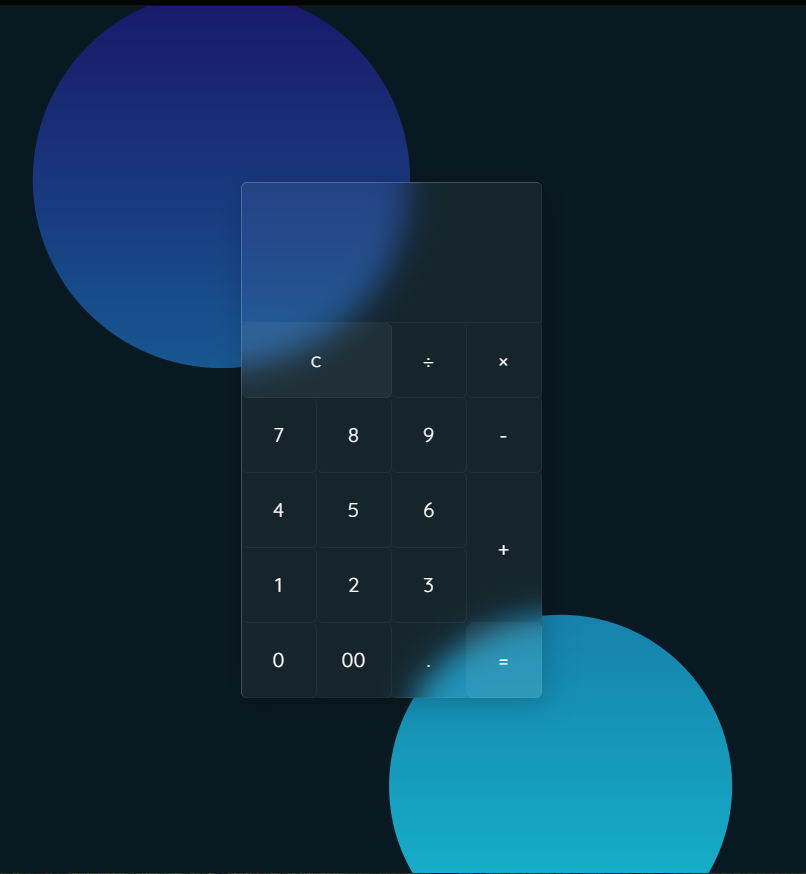

# Calculadora-with-effects
 Criando calculadora usando JavaScript e CSS Glassmorphism Effects

 ## Demonstration

 
 

 ## Techs

 * [ ] HTML
 * [ ] CSS
 * [ ] JavaScript

 ### Reproduced

 **Emerson Costa**

 ## Encontre-me nas redes sociais: 

 *Instagram*

 @emerson_b_costa

 *Linkedin*

 https://www.linkedin.com/in/joseemersoncosta/

